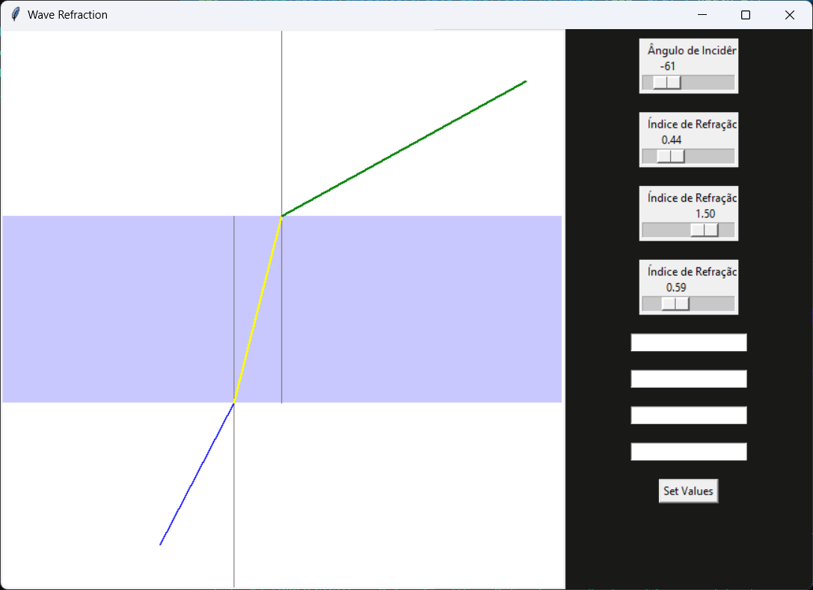

# Wave Refraction Simulation

Este repositório contém um código em Python que simula a refração de ondas através de diferentes meios, utilizando a Lei de Snell. A simulação permite ajustar o ângulo de incidência e os índices de refração dos meios em tempo real, oferecendo uma visualização interativa do fenômeno.

## Funcionalidades

- **Ajuste Dinâmico do Ângulo de Incidência**: Utilize uma barra deslizante e uma caixa de entrada para ajustar o ângulo de incidência da onda.
- **Controle dos Índices de Refração**: Modifique os índices de refração dos três meios através de sliders, para observar como as ondas se comportam ao passar de um meio para outro.
- **Visualização Interativa**: A simulação desenha as ondas refratadas e reflete o efeito de alterações em tempo real.

## Requisitos

- Python 3.x
- Tkinter (geralmente incluído na instalação padrão do Python)

